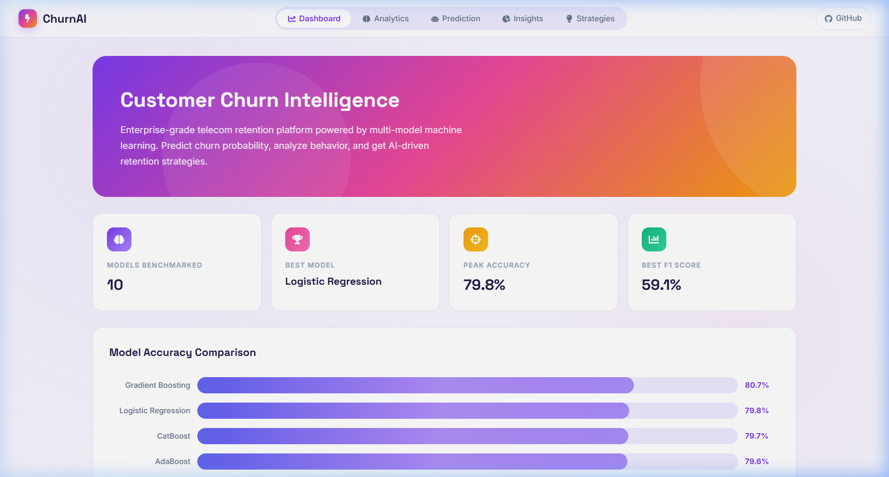
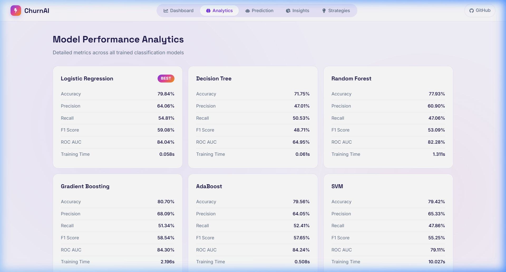
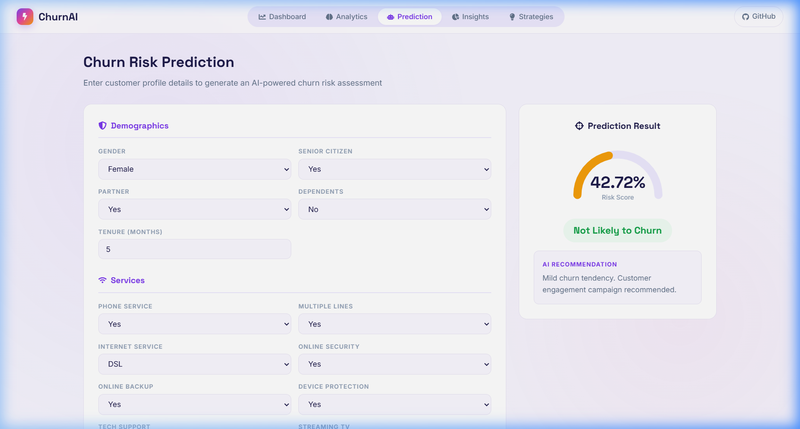
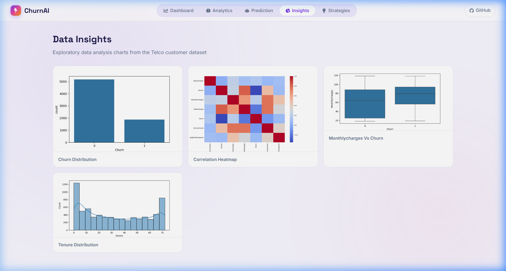
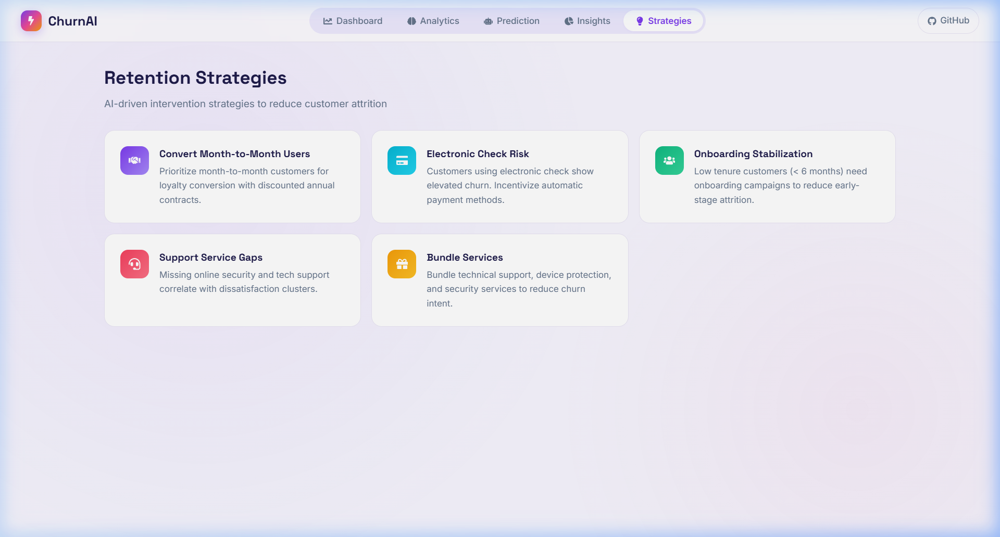

<div align="center">

# ⚡ ChurnAI Pro

### Customer Churn Intelligence Platform

*Predict customer attrition before it happens. Powered by 10 ML models, validated business logic, and a modern analytics dashboard.*

[](https://python.org)
[](https://fastapi.tiangolo.com)
[](https://react.dev)
[](https://vite.dev)
[](https://scikit-learn.org)

---



</div>

## 📌 About

ChurnAI Pro is an end-to-end **customer churn prediction system** for telecom companies. It benchmarks **10 classification models**, identifies the best performer, and provides an interactive prediction tool with AI-generated retention recommendations.

> **What is churn?** — When a customer cancels their subscription and leaves. Predicting this early allows companies to intervene with retention strategies.

### ✨ Key Features

| Feature | Description |
|---------|-------------|
| 🧠 **10 Model Benchmark** | Logistic Regression, Decision Tree, Random Forest, Gradient Boosting, AdaBoost, SVM, KNN, Naive Bayes, XGBoost, CatBoost |
| 📊 **Analytics Dashboard** | Side-by-side model accuracy, F1, precision, recall, ROC AUC, and training time |
| 🎯 **Live Prediction** | Interactive form → real-time churn probability with animated risk gauge |
| 💡 **AI Recommendations** | Context-aware retention strategies based on the customer profile |
| 📈 **EDA Insights** | Auto-generated charts — churn distribution, correlation heatmap, tenure analysis |
| ✅ **Logic Validation** | Automated test proving the model follows real-world business patterns |

---

## 🖼️ Screenshots

<details>
<summary><b>📊 Model Performance Analytics</b></summary>
<br/>



Detailed metrics for all 10 trained models with a "Best Model" badge on the top performer.

</details>

<details>
<summary><b>🎯 Churn Risk Prediction</b></summary>
<br/>



Enter any customer profile → get instant churn probability with a risk gauge and retention recommendation.

</details>

<details>
<summary><b>📈 Data Insights</b></summary>
<br/>



Exploratory data analysis charts generated from the Telco customer dataset.

</details>

<details>
<summary><b>💡 Retention Strategies</b></summary>
<br/>



AI-driven recommendations — contract conversion, payment method optimization, service bundling, and more.

</details>

---

## 🏗️ Architecture

```
customer-churn-ai-system/
│
├── backend/                    # FastAPI server
│   ├── app.py                  # API routes (/predict, /metrics, /test, /eda-images)
│   ├── config.py               # Configuration
│   ├── requirements.txt        # Python dependencies
│   ├── data/                   # Telco customer dataset (CSV)
│   ├── eda/                    # EDA chart generation & saved PNGs
│   ├── models/
│   │   ├── train_models.py     # Train & benchmark 10 ML models
│   │   ├── predict.py          # Prediction logic with scaling & encoding
│   │   ├── test_predict.py     # Automated accuracy validation
│   │   ├── logic_validation.py # Business logic stress test
│   │   └── saved_models/       # Pickled model, scaler, encoders
│   ├── preprocessing/          # Data cleaning, encoding, feature engineering
│   └── utils/                  # Helper functions
│
├── frontend/                   # React + Vite
│   ├── src/
│   │   ├── App.jsx             # Main application (all 5 pages)
│   │   ├── App.css             # Light aurora theme design system
│   │   └── index.css           # Global styles & fonts
│   └── package.json
│
├── assets/                     # README screenshots
└── .gitignore
```

---

## 🚀 Getting Started

### Prerequisites

- **Python 3.12+**
- **Node.js 18+**

### 1. Clone the repository

```bash
git clone https://github.com/Mujjjtaba/customer-churn-ai-system.git
cd customer-churn-ai-system
```

### 2. Set up the backend

```bash
cd backend
python -m venv .venv
.venv\Scripts\activate        # Windows
# source .venv/bin/activate   # macOS/Linux

pip install -r requirements.txt
```

### 3. Train the models (first time only)

```bash
python -c "from models.train_models import *"
```

### 4. Start the backend server

```bash
uvicorn app:app --reload --port 8000
```

### 5. Set up & start the frontend

```bash
cd ../frontend
npm install
npm run dev
```

### 6. Open the app

Visit **http://localhost:5173** in your browser.

---

## 🧪 Model Validation

The system includes automated validation to prove the model follows correct business logic:

```bash
cd backend
python models/logic_validation.py
```

### Validation Results

| Factor | Effect on Churn | Business Logic |
|--------|:---:|----------------|
| 🧓 Senior Citizen | **+8.77%** ↑ | Less tech-savvy → more frustrated |
| 👨‍👩‍👧 Family (partner + dependents) | **-5.80%** ↓ | Family ties → stickier customer |
| 📵 No Phone Service | **+16.20%** ↑ | Fewer services → less invested |
| 🛡️ Security + Backup + Protection | **-19.81%** ↓ | Feels safe → stays |
| 🎧 Tech Support ON | **-11.09%** ↓ | Gets help → satisfied |
| 📝 Two-year contract | **-33.43%** ↓ | Locked in → very sticky |
| 💰 $120/month (expensive) | **+12.71%** ↑ | Not affordable → looking to leave |
| 🏦 Auto bank transfer | **-4.35%** ↓ | Set & forget → less friction |
| ⏳ 6 years tenure | **-44.53%** ↓ | Loyalty → strongest retention factor |

> **Extreme scenario spread: 77.3 percentage points** — WORST case (77.7%) vs BEST case (0.45%)

---

## 📡 API Endpoints

| Method | Endpoint | Description |
|--------|----------|-------------|
| `POST` | `/predict` | Predict churn for a customer profile |
| `GET` | `/metrics` | Get all model benchmark metrics |
| `GET` | `/eda-images` | List available EDA chart images |
| `GET` | `/test` | Run automated accuracy validation |

### Example: Predict Churn

```bash
curl -X POST http://127.0.0.1:8000/predict \
  -H "Content-Type: application/json" \
  -d '{
    "gender": "Male",
    "SeniorCitizen": 1,
    "Partner": "No",
    "Dependents": "No",
    "tenure": 2,
    "PhoneService": "Yes",
    "MultipleLines": "No",
    "InternetService": "Fiber optic",
    "OnlineSecurity": "No",
    "OnlineBackup": "No",
    "DeviceProtection": "No",
    "TechSupport": "No",
    "StreamingTV": "No",
    "StreamingMovies": "No",
    "Contract": "Month-to-month",
    "PaperlessBilling": "Yes",
    "PaymentMethod": "Electronic check",
    "MonthlyCharges": 70.0,
    "TotalCharges": 140.0
  }'
```

---

## 🛠️ Tech Stack

<table>
<tr>
<td align="center"><b>Category</b></td>
<td align="center"><b>Technology</b></td>
</tr>
<tr>
<td>Backend Framework</td>
<td>FastAPI + Uvicorn</td>
</tr>
<tr>
<td>ML Libraries</td>
<td>scikit-learn, XGBoost, CatBoost, LightGBM</td>
</tr>
<tr>
<td>Data Processing</td>
<td>Pandas, NumPy</td>
</tr>
<tr>
<td>Frontend Framework</td>
<td>React 19 + Vite 8</td>
</tr>
<tr>
<td>Styling</td>
<td>Custom CSS (Aurora Light Theme)</td>
</tr>
<tr>
<td>HTTP Client</td>
<td>Axios</td>
</tr>
<tr>
<td>Icons</td>
<td>React Icons (Font Awesome)</td>
</tr>
<tr>
<td>Fonts</td>
<td>Inter + Space Grotesk (Google Fonts)</td>
</tr>
</table>

---

## 📝 License

This project is open source and available under the [MIT License](LICENSE).

---

<div align="center">

**Built with ❤️ by [Mujtaba](https://github.com/Mujjjtaba)**

</div>
